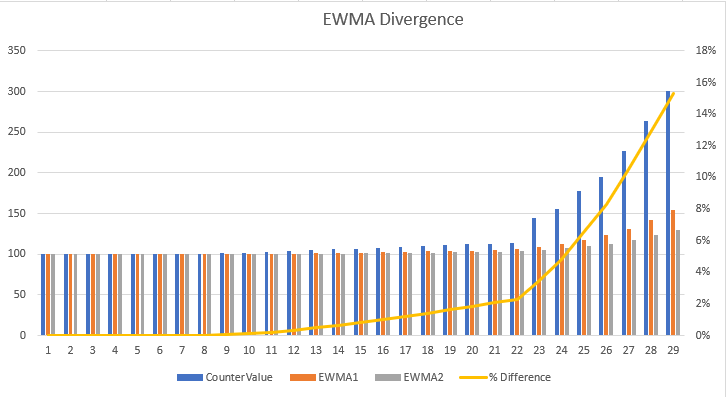
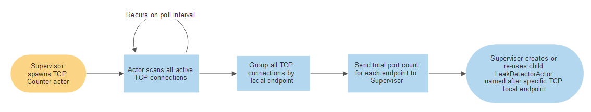
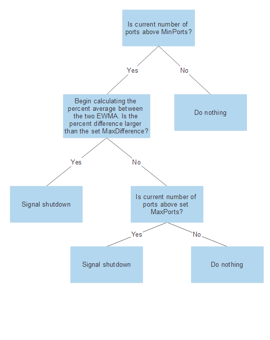

# SocketLeakDetection

Stand-alone application and Akka.NET actors who can detect socket leaks and port exhaustion anywhere on the local system.

## Building this solution
To run the build script associated with this solution, execute the following:

**Windows**
```
c:\> build.cmd all
```

**Linux / OS X**
```
c:\> build.sh all
```

If you need any information on the supported commands, please execute the `build.[cmd|sh] help` command.

This build script is powered by [FAKE](https://fake.build/); please see their API documentation should you need to make any changes to the [`build.fsx`](build.fsx) file.

### Conventions
The attached build script will automatically do the following based on the conventions of the project names added to this project:

* Any project name ending with `.Tests` will automatically be treated as a [XUnit2](https://xunit.github.io/) project and will be included during the test stages of this build script;
* Any project name ending with `.Tests` will automatically be treated as a [NBench](https://github.com/petabridge/NBench) project and will be included during the test stages of this build script; and
* Any project meeting neither of these conventions will be treated as a NuGet packaging target and its `.nupkg` file will automatically be placed in the `bin\nuget` folder upon running the `build.[cmd|sh] all` command.

### DocFx for Documentation
This solution also supports [DocFx](http://dotnet.github.io/docfx/) for generating both API documentation and articles to describe the behavior, output, and usages of your project. 

All of the relevant articles you wish to write should be added to the `/docs/articles/` folder and any API documentation you might need will also appear there.

All of the documentation will be statically generated and the output will be placed in the `/docs/_site/` folder. 

#### Previewing Documentation
To preview the documentation for this project, execute the following command at the root of this folder:

```
C:\> serve-docs.cmd
```

This will use the built-in `docfx.console` binary that is installed as part of the NuGet restore process from executing any of the usual `build.cmd` or `build.sh` steps to preview the fully-rendered documentation. For best results, do this immediately after calling `build.cmd buildRelease`.

### Release Notes, Version Numbers, Etc
This project will automatically populate its release notes in all of its modules via the entries written inside [`RELEASE_NOTES.md`](RELEASE_NOTES.md) and will automatically update the versions of all assemblies and NuGet packages via the metadata included inside [`common.props`](src/common.props).

If you add any new projects to the solution created with this template, be sure to add the following line to each one of them in order to ensure that you can take advantage of `common.props` for standardization purposes:

```
<Import Project="..\common.props" />
```

### Code Signing via SignService
This project uses [SignService](https://github.com/onovotny/SignService) to code-sign NuGet packages prior to publication. The `build.cmd` and `build.sh` scripts will automatically download the `SignClient` needed to execute code signing locally on the build agent, but it's still your responsibility to set up the SignService server per the instructions at the linked repository.

Once you've gone through the ropes of setting up a code-signing server, you'll need to set a few configuration options in your project in order to use the `SignClient`:

* Add your Active Directory settings to [`appsettings.json`](appsettings.json) and
* Pass in your signature information to the `signingName`, `signingDescription`, and `signingUrl` values inside `build.fsx`.

Whenever you're ready to run code-signing on the NuGet packages published by `build.fsx`, execute the following command:

```
C:\> build.cmd nuget SignClientSecret={your secret} SignClientUser={your username}
```

This will invoke the `SignClient` and actually execute code signing against your `.nupkg` files prior to NuGet publication.

If one of these two values isn't provided, the code signing stage will skip itself and simply produce unsigned NuGet code packages.

##Project Description

This project is designed to help detect a sudden increase in the TCP port count in a system, and gracefully shutdown the `ActorSystem` when this is observed. The configuration can be set to monitor slow increases or fast spikes in TCP port growth for one ore more local endpoints. 

###Methodology 

The impulse response is done through the use of an Exponential Weighted Moving Average(EWMA). `EWMA` allows the observer to determine how much weight we want to emphasize in older readings versus newer readings. 

To calculate when a large increase in TCP ports is detected, two EWMA's will be taken. One will have a short sample size and the second will have a larger sample size. Having a shorter sample size will result in the average being more responsive to change. Where a larger sample size will smooth out quick changes and be less responsive to change.

Using this behavior, we compare the two EWMA's and determine the difference between the two. When a spike in TCP port count is experienced, the short sample EWMA will grow faster than the long sample EWMA will take longer to normalize. The percent difference between the two, will signal how quickly the TCP growth is. To monitor a fast change and have the system be more responsive to an increase, you will want to keep these sample sizes smaller. If you would like to monitor slower gradual changes, the sample rates can be increased. 

The main way to detect a growth in TCP port count will be through the use of these average differences. However you may have a case where the growth in TCP port count is gradually increasing. Gradual enough where the difference between the two averages does not trigger a warning. To prevent the system from reaching a TCP exhaustion in such a a case, a limit can be set on the maximum number of ports an endpoint can have. When this maximum amount is set, the `ActorSystm` will be terminated when the port count exceeds this threshold. 

The following is a graphical interpretation of how the system works when the there is an increase in the count, how each EWMA reacts to the change and how the percent difference grows due to this. In the values below, EMWA1 is our short sample EMWA and EWMA2 is our long sample EWMA. With CounterValue being the actual count we are seeing.

  ***EWMA Divergence Graph***
<div style="text-align:center"></div>

###Implementation

The project is intended to help detect and warn when an increase in TCP port count is expected for one or more network interfaces. The project will be implemented by the creation of a `TcpPortUseSupervisor` actor. This actor will be created using the `ActorSystem` that we want to monitor and terminate in case of a large increase in TCP port count. 

***A work flow of the TCP port detection process***



The `TcpPortUseSupervisor` actor will create a  TcpPortMonitoringActor which will scan all of the open TCP ports and group these by the local endpoint.  The count for each local endpoint will then be sent back to the `TcpPortUseSupervisor` actor. 

The `TcpPortUseSupevisor` actor will then take these readings and determine if the number of TCP ports exceeds our normal operating numbers(MinPorts). If the `MinPorts` number is exceeded, the actor will then signal the `SocketLeakDetectorActor` to begin monitoring the TCP ports for that particular endpoint. 

The `SocketLeakDetectorActor` will then continue to monitor the TCP port count for the specified endpoint through the use of EWMA's. When a fast increase in the TCP count is observed that exceeds the defined `MaxDifference`, a warning will be logged and a timer will be started. If the increase does not normalize within the set `BreachDuration` period, this actor will then signal the `TcpPortUseSupevisor` actor that we need to terminate the `ActorSystem` to prevent port exhaustion. 

If the `SocketLeakDetectorActor` does not see a fast increase in the TCP port count but does see a continuous increase in the TCP port count, it will continue to monitor that local endpoint. If the number of TCP ports exceeds the `MaxPorts` allowed and does not drop below the `MaxPorts` within the `BreachDuration` period, the `SocketLeakDetectorActor` will send a termination message back to the `TcpPortUseSupevisor` Actor. 

A `BreachDuration` period is set to allow the system to normalize in the event that the system experiences a short increase in the TCP port count but is able to lower these ports back to a normal state without outside intervention. 
<div>
<div style="text-align:center">The signal shutdown logic can be seen in the below diagram</div>


###Configuration

You will only need to create the `TcpPortUseSupervisor` actor to be able to monitor the TCP port growth in your system. This actor comes with default settings and does not require you to pass any customized settings for it to be used. You can however, create your own `SocketLeakDetectorSettigns` to modify how responsive you want your system to be. The following are the configurable settings: 

####SocketLeakDetectorSettings

**MaxPorts**: The maximum allowed TCP ports for a set endpoint. If a port count for a particular endpoint exceeds this number, we will signal for the `ActorSystem` to be shutdown if it does not fall below the `MaxPorts` count under the `BreachDuration` period. 

If you will like to have a maximum number of ports allowed before the `ActorSystem` is terminated you will want to edit this number. 

***The default value*** is set to 65536 ports, which is the theoretical max allowed number of ports you can have on one endpoint. Please note you want the `MaxPorts` to be larger than your `MinPorts`.

**MinPorts**: When a particular endpoint port count exceeds this number the `TcpPortUseSupervisor` will begin calculating the EWMA to see if a large increase is detected. 

You will want to set this number above the normal expected port count you plan to see for your system.

***The default value*** set for this is for 100 ports. 

**MaxDifference**: This will signal the max difference between the short sample EWMA and the long sample EWMA allowed. If the difference between the two EWMA remains above `MaxDifference` for longer than the set `BreachDuration`, the system will be terminated. 

The faster the growth in TCP, the larger the difference you will see between these two. You will want to set this number to a lower value if want your system to be more sensitive to fast change. 

***The default value*** set for this is for 0.20, which signals a 20% difference between the two averages. 

**LongSampleSize**: This will be the set sample size used for the long sample EWMA. The higher this number the less responsive the EWMA will be to change. 

***The default value*** will be for a sample size of 50. 

**ShortSampleSize**: This will be the set sample size used for the short sample EWMA. The lower this number the more responsive the EWMA will be to change. 

***The default value*** will be for a sample size of 10. 

**Important note about setting your LongSampleSize and ShortSampleSize**: The closer these values are to each other, the faster the change in TCP growth will have to be for us to see a percent difference between the two EWMA's. The higher the number for these values, the less responsive they will be to change and the higher the growth you will need to see for the difference to grow. 

**PortCheckInterval**: The interval that we would like to sample the TCP port count. The shorter the interval the less responsive the system will be to change. 

***The default value*** will be of 1 second. 

**BreachDuration**: The max time you would like to give the system to recover from an observed TCP port growth, if the `MaxDifference` or the `MaxPorts` are exceeded. If either are exceeded and the system does not fall below the `MaxDifference` or `MaxPorts`respectively, the `ActorSystem` will be terminated. 

***The default value*** will be for 25 seconds. 


**IPAddress**: If you do not want to monitor all of the local endpoints, you can pass in a list of `IPAddress` as a parameter to you `TcpPortUseSupervisor` actor. When you pass in a list of `IPAddress`, these will be white-listed and all other `IPAddress` will be ignored for TCP port growth. When no list is `IPAddress` is passed as a parameter, all local endpoints will be monitored for TCP growth. 

***The default value*** for this parameter is to look for all the endpoints. If you do not wish to monitor all of the endpoints you can pass in a list with one or more `IPAddress` which you wish to monitor for this `ActorSystem`. 

##Setting up the TcpPortUseSupervisor actors

The following are three ways to setup your `TcpPortUseSupervisor`: 

**Setting up your actor with default settings to monitor all local endpoints**

```csharp
var actorSystem = ActorSystem.Create("PortDetector", "akka.loglevel = DEBUG"); 
var supervisor = actorSystem.ActorOf(Props.Create(() => new TcpPortUseSupervisor()), "tcpPorts");
await actorSystem.WhenTerminated;
```

**Setting up your actor with customized settings to monitor all local endpoints**

```csharp
var actorSystem = ActorSystem.Create("PortDetector", "akka.loglevel = DEBUG");
SocketLeakDetectorSettings settings = new SocketLeakDetectorSettings
{
	MaxDifference = 0.3,
	MaxPorts = 120,
	MinPorts = 80,
    LongSampleSize = 120,
    ShortSampleSize = 80,
    BreachDuration = TimeSpan.FromSeconds(30),
    PortCheckInterval = TimeSpan.FromMilliseconds(500)
};

var supervisor = actorSystem.ActorOf(Props.Create(() => new TcpPortUseSupervisor(settings)), "tcpPorts");
```

***Setting up your actor with only one white-listed address***

```csharp 
var actorSystem = ActorSystem.Create("PortDetector", "akka.loglevel = DEBUG");
List<IPAddress> iPList = new List<IPAddress> { IPAddress.Parse("127.0.0.1") };	               
var supervisor = actorSystem.ActorOf(Props.Create(() => new TcpPortUseSupervisor(iPList)), "tcpPorts"); 
```

